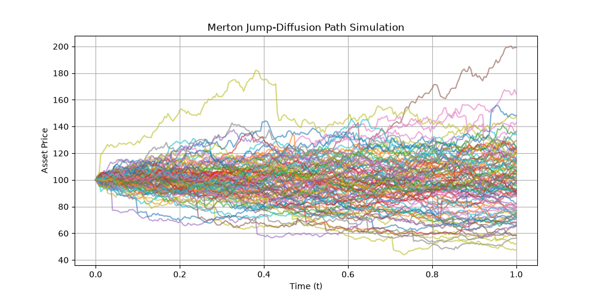

# stochcalc

`stochcalc` is a Python library designed for vectorized stochastic process simulation, numerical SDE solving with physical boundary conditions, and symbolic stochastic calculus. 

---

## Features

- **Flexible Time Grid Engine:** Supports uniform continuous intervals and discrete, non-uniform event schedules natively.
- **Path Simulators:** Highly vectorized implementations of standard models:
  - Continuous: Brownian Motion (with correlation), Geometric Brownian Motion, and Fractional Brownian Motion (Cholesky covariance method).
  - Jumps & Jump-Diffusions: Gamma, Variance Gamma, Compound Poisson, and Merton Jump-Diffusion processes.
- **Robust SDE Solvers:** 
  - Standard Euler-Maruyama, Milstein, and Platen RK 1.0 schemes.
  - Adaptive step-size solvers with error tolerances.
  - Enforced physical boundary conditions (reflecting and absorbing barriers) to prevent discretization violations.
- **Hardware Acceleration:** PyTorch-powered GPU-accelerated solvers (supporting CUDA and Apple Silicon MPS backends).
- **Symbolic Calculus Engine:** 
  - Automated multidimensional Ito's Lemma transformations.
  - Infinitesimal generator calculation.
  - Conversions between Ito and Stratonovich SDE formulations.
  - Girsanov transformation and Radon-Nikodym density process generation.
  - Automated PDE generation (Fokker-Planck and Feynman-Kac equations).
- **Advanced Pricing & Greeks:** 
  - European option pricing via the Fourier COS method.
  - Malliavin Calculus weights for pathwise Greeks (Delta and Gamma estimation).

---

## Installation

To install `stochcalc` locally in editable development mode, clone the repository and run:

```bash
pip install -e .
```

---

## Quick Start Examples

### 1. Vectorized Merton Jump-Diffusion Simulation

```python
import numpy as np
import matplotlib.pyplot as plt
from stochcalc import TimeGrid, MertonJumpDiffusion

# Define an event-driven grid
grid = TimeGrid(start=0.0, end=1.0)

# Initialize process
mjd = MertonJumpDiffusion(
    grid=grid,
    mu=0.05,
    sigma=0.2,
    S0=100.0,
    lam=2.0,            # 2 jumps per year on average
    jump_mean=-0.05,    # Jump mean size (log scale)
    jump_std=0.1        # Jump volatility
)

# Simulate 100 paths over 250 steps
times, paths = mjd.simulate_paths(num_paths=100, steps=250)

# Plot sample paths
plt.figure(figsize=(10, 5))
plt.plot(times, paths[:, :, 0].T, alpha=0.6)
plt.title("Merton Jump-Diffusion Path Simulation")
plt.xlabel("Time (t)")
plt.ylabel("Asset Price")
plt.grid(True)
plt.show()
```
>>> 

### 2. Symbolic Ito's Lemma & Stratonovich Conversion

```python
import sympy as sp
from stochcalc import SymbolicSDE, symbolic_ito, ito_to_stratonovich

# Define symbols
x, t = sp.symbols('x t')
mu, sigma = sp.symbols('mu sigma')

# 1. Initialize an Ito SDE (Geometric Brownian Motion)
gbm_ito = SymbolicSDE(
    state_vars=[x],
    drift=[mu * x],
    diffusion=[[sigma * x]],
    time_var=t
)

# 2. Apply Ito's Lemma to f(x) = log(x)
f = sp.log(x)
transformed = symbolic_ito(f, [x], gbm_ito)
print("Ito transformation of log(x):")
print(transformed)  # dY_1 = (mu - 0.5*sigma**2)*dt + sigma*dW_1

# 3. Convert original Ito SDE to its equivalent Stratonovich representation
gbm_strato = ito_to_stratonovich(gbm_ito)
print("\nEquivalent Stratonovich SDE:")
print(gbm_strato)  # dx = ((mu - 0.5*sigma**2)*x)*dt + (sigma*x)*o_dW_1
```
>>> Ito transformation of log(x):
>>> dY_1 = (mu - 0.5*sigma**2)*dt + (sigma)*dW_1

>>> Equivalent Stratonovich SDE:
>>> dx = (x*(mu - 0.5*sigma**2))*dt + (sigma*x)*dW_1

### 3. Option Pricing via Fourier COS

```python
import numpy as np
from stochcalc import FourierCOS

# Market parameters
S0, K, rate, T, vol = 100.0, 100.0, 0.05, 1.0, 0.2

# Define Black-Scholes log-characteristic function
def bs_characteristic_function(u):
    return np.exp(1j * u * (rate - 0.5 * vol**2) * T - 0.5 * vol**2 * u**2 * T)

# Initialize calculation engine
cos_engine = FourierCOS()
call_price = cos_engine.price_european(
    char_func=bs_characteristic_function,
    S0=S0, K=K, r=rate, T=T,
    option_type="call"
)

print(f"Fourier COS European Call Price: {call_price:.5f}")
```
>>> Fourier COS European Call Price: 10.45058
